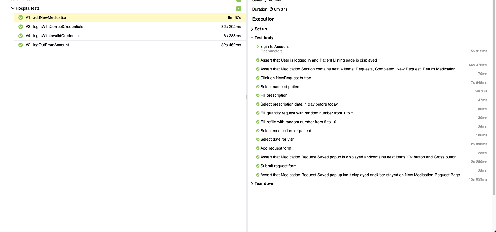
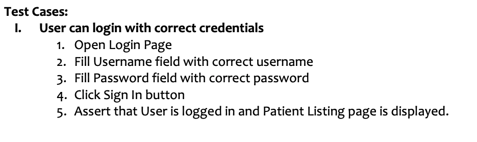
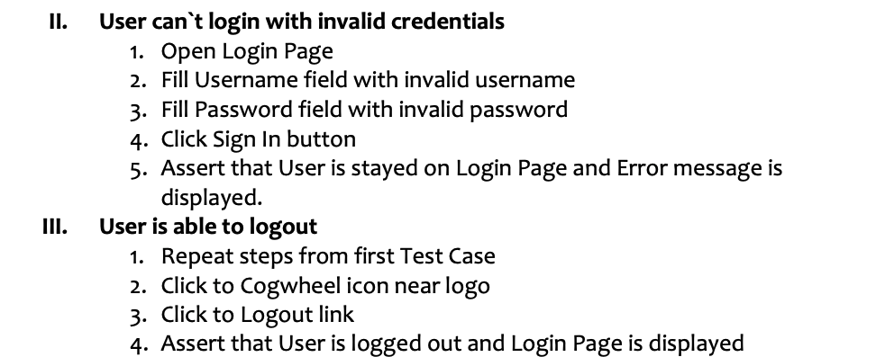
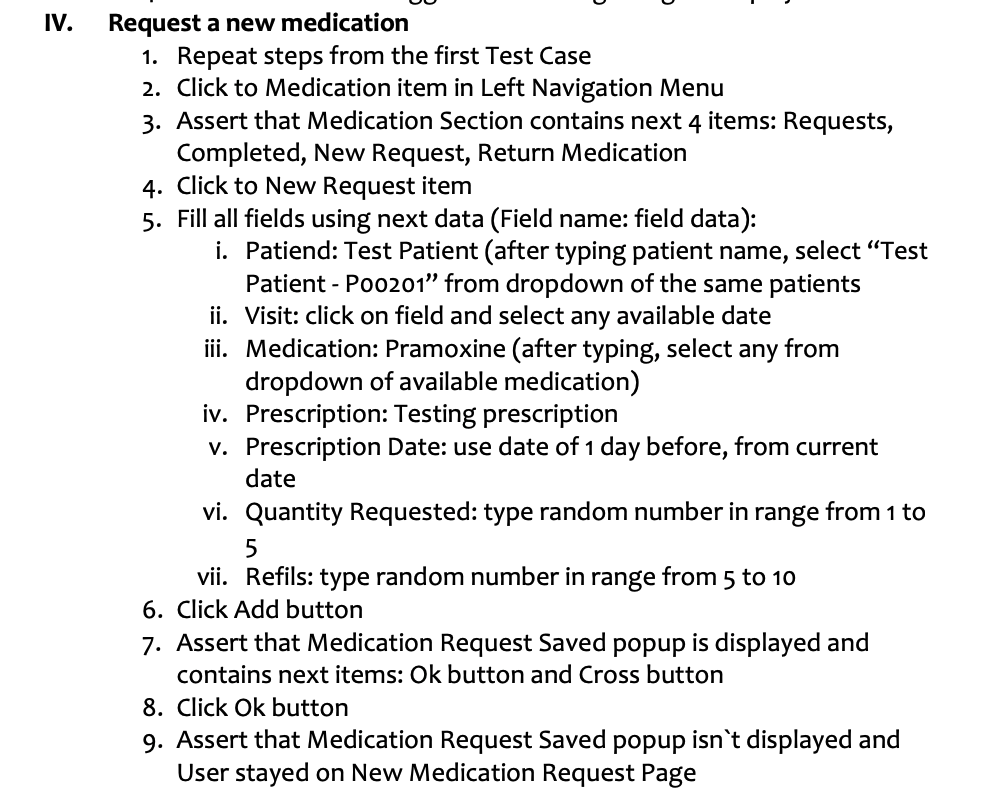

# Автотесты UI для тестового задания на сайте http://demo.hospitalrun.io/

## Используемые технологии и инструменты
Java,Selenium,TestNG,Maven,Allure Report,Owner,AssertJ

## Инструкция по запуску тестов

Запуск тестов происходит через консоль

Запуск в Chrome

```bash
mvn clean test
```
Запуск в FireFox

```bash
mvn clean test -Dbrowser=firefox
```

### Serve report:

```bash
allure serve target/allure-results
```

### Анализ результатов в Allure


### Тест Кейсы




